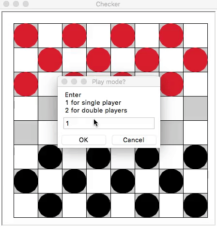
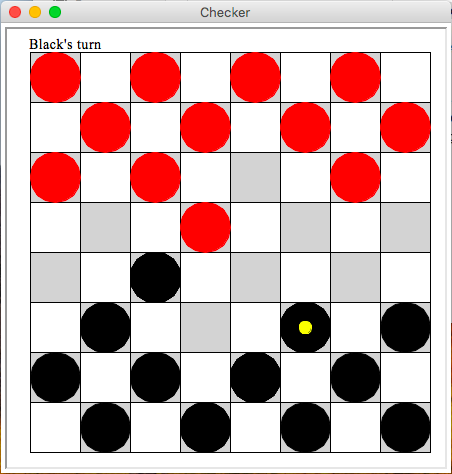
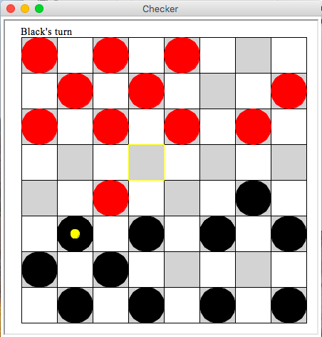
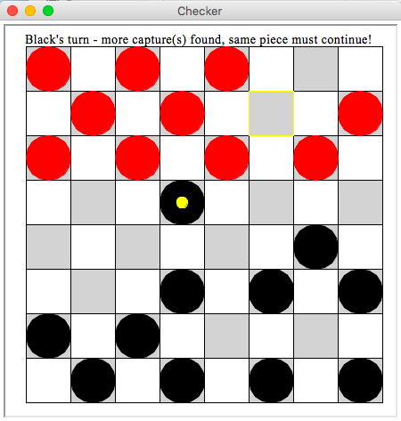
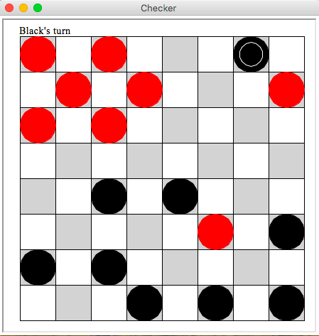
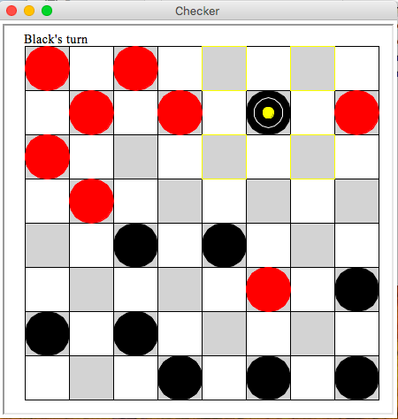
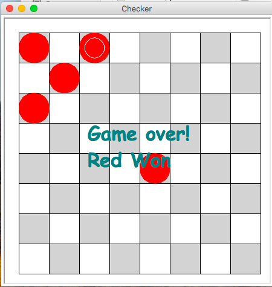

# checkerbroad-game
Checkerbroad game is written in Python and run on the processing platform

# About the game
* Interactive visualization, easy-to-follow guidance on the screen
* Fun
* 2 play modes: Single player (against AI) or double players (great to compete against your friend)

# Demo after being ran on VSCode

## Single player

# Quick set of rules
* Pieces can only move diagonally.
* Non-king pieces can only move forward.
* Black always goes first.

> When a piece is clicked, possible move(s) will be indicated. If you click on enemy's pieces, nothing will be shown.

* You can only capture the enemy's piece(s). You cannot jump over your own pieces.

* When possible capture(s) available, that's the only move(s) can be made.

* Multiple captures enforced: after 1 capture, if there're more, you must finish them all.

> Notice how the direction changed to prompt user to continue.

* King pieces: When a piece get to the end of enemy's side, it becomes King - it now can move diagonally in 4 directions.

* Game over: Winner will be determined if all enemy's pieces are captured or enemy cannot make any moves.

### Please let me know if you find any bugs or encounter any issues. I will be very appreciative!